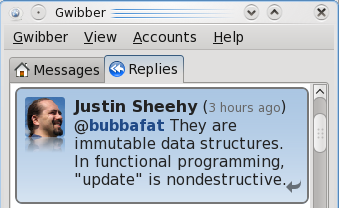

The first episode of The [X-Files](http://en.wikipedia.org/wiki/The_X-Files) I ever saw was the [Home](http://en.wikipedia.org/wiki/Home_%28The_X-Files%29).  I was hooked immediately - and at the same time somewhat disappointed.  This was before on-demand TV, hulu or DVD compilations on NetFlix.  I had missed more than 3 seasons of a what was clearly going to be one of my favorite shows and there the only way to catch up was the hope that the next rerun would be one I hadn't seen.  Then it got all weird and aliens were showing up too often, Mulder basically disappeared and The Lone Gunman got their own spinoff ...

Learning Erlang is a little like seeing the first episode.  I'm hooked immediately - and at the same time somewhat disappointed.  I'm years behind again.  At least this time I don't need to fret over not being able to find the reruns I want and there is very little risk that [Dean Haglund](http://www.deanhaglund.com/) will make an appearance (I bet Langly knew Erlang).

A few minutes ago I had my first significant Aha! moment.  In my effort to map what I do know (procedural/OO paradigms) to Erlang I wondered "how would a balance tree be implemented in Erlang".  I binged (yeah, I said it) for "[Erlang balanced trees](http://www.bing.com/search?q=Erlang+balanced+trees)" and quickly found the [gb\_trees](http://www.erlang.org/doc/man/gb_trees.html) module.

What I wanted to understand was:

1. How is the tree represented in Erlang?
2. How is the tree (and it's nodes) modified (insert, update, delete, etc)?
3. Can processes share the same tree (and how is concurrency handled)?

## How is the tree represented in Erlang?

This took me the longest to understand - but once it fell into place everything else made so much more sense.  If you are curious go ahead and open up gb\_trees.erl (on my machine it's in /usr/lib/erlang/lib/stdlib-1.15.5/src) - now go to the definition of the node and tree types.  Go ahead... I'll wait.

Found them yet?  No?  Maybe it's in some header file.  Feel free to check ... in the meantime I'll continue.

Ready for this?  There isn't one.  You don't need to define a tree or node type - it's just a tuple that gets passed around and interpreted at runtime.  Not quite clear?  OK - if we were going to define it, it would look something like this:

`{Size, {Key, Value, Smaller, Bigger}}`

- **Size** is the number of nodes in the tree (which is used for balancing).
- **Key** is the key of the current node.
- **Value** is the value associated with Key.
- **Smaller** is the nodes that are smaller (i.e. "to the left").
- **Bigger** is nodes that are bigger ("to the right").

These functions really helped make it much clearer:

%%-spec(empty/0 :: () -> gb\_tree()).

empty() ->
    {0, nil}.

%%-spec(is\_empty/1 :: (gb\_tree()) -> bool()).

is\_empty({0, nil}) ->
    true;
is\_empty(\_) ->
    false.

%%-spec(size/1 :: (gb\_tree()) -> non\_neg\_integer()).

size({Size, \_}) when is\_integer(Size), Size >= 0 ->
    Size.

"size" says so much it's wonderful.  Besides the obvious of getting the size of the tree it also validates that the size is greater-than-or-equal-to zero otherwise there will be an exception.  This is a great example of Erlang failing fast.  Try it out:

2> gb\_trees:size({-1, {\[\]}}).
\*\* exception error: no function clause matching gb\_trees:size({-1,{\[\]}})

See - the clause doesn't match and an exception is thrown.  Think of the comparable C++ code.  It would look something like:

int size(Tree \*tree) {
    if (tree == null) {
        throw ...;
    }
    
    if(tree->size < 0) {
        throw ...;
    }
    
    return tree->size;
}

## How is the tree modified?

I think gb\_trees:update is the most approachable example of this.  Besides being crazy small it is a very clear example of how the tree is walked to search for the key and how error handling is meant to be done.

%%-spec(update/3 :: (\_, \_, gb\_tree()) -> gb\_tree()).

update(Key,  Val, {S, T}) ->
    T1 = update\_1(Key, Val, T),
    {S, T1}.

%% See \`lookup' for notes on the term comparison order.

update\_1(Key, Value, {Key1, V, Smaller, Bigger}) when Key < Key1 -> 
    {Key1, V, update\_1(Key, Value, Smaller), Bigger};
update\_1(Key, Value, {Key1, V, Smaller, Bigger}) when Key > Key1 ->
    {Key1, V, Smaller, update\_1(Key, Value, Bigger)};
update\_1(Key, Value, {\_, \_, Smaller, Bigger}) ->
    {Key, Value, Smaller, Bigger}.

Notice first that since update is never changing the size it does not bother to pass it to update\_1 - only the "node" portion of the tuple is passed.

Once passed there are four possible options - three of which need to be codified (in the same order as the code):

1. The provided key is smaller than the current tree node.  In this case build up a new result and call update\_1 with update\_1(Key, Value, Smaller) - "walk left"
2. The provided key is larger than the current tree node.  Walk right.
3. The provided key is exactly the current node key (not too big ... not to small ... just right!).  In this case build up a new node with the new value.
4. (implicit) The provided key is not in the tree.  Throw an exception.

In the case where the node is not found update\_1 ends up being called like:

update\_1(Key, Value, nil)

Since the match on #1-3 require a non-nil tuple this turns into a missing function clause error.

## Can processes share the same tree?

No.  No they can't.  I was having a little trouble groking this until I ran through some samples in erl.  This is what made it clear for me:

`1> Tree = gb_trees:empty(). {0,nil} 2> Tree2 = gb_trees:insert("Foo", "Bar", Tree). {1,{"Foo","Bar",nil,nil}} 3> Tree3 = gb_trees:update("Foo", "NewBar", Tree2). {1,{"Foo","NewBar",nil,nil}} 4> Tree4 = gb_trees:update("Missing", "value", Tree3). ** exception error: no function clause matching gb_trees:update_1("Missing","value",nil) in function gb_trees:update_1/3 in call from gb_trees:update/3`

Each time anything was done a new tree was created - the old tree was still valid and could be used but it was not the new tree.  It's the old tree.  This boggled me for a few minutes until [Justin Sheehy](https://twitter.com/justinsheehy) confirmed what the code was saying.

So no - multiple processes could not possibly share the tree because the tree is immutable.

Want proof?  Go back to erl and run gb\_trees:get on the key "Foo" on Tree, Tree2 and Tree3.  Tree will error (it's an empty tree).  Tree2 will find "Bar" and Tree3 will find "NewBar".

`14> gb_trees:get("Foo", Tree). ** exception error: no function clause matching gb_trees:get_1("Foo",nil) 15> gb_trees:get("Foo", Tree2). "Bar" 16> gb_trees:get("Foo", Tree3). "NewBar"`

**Aha!**
