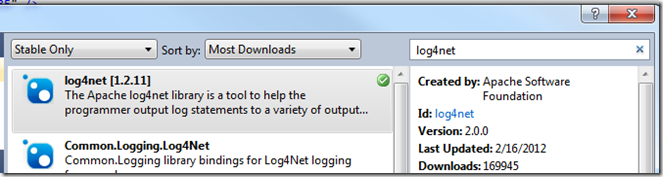

I need how much space?

Maybe I’m dense.  But I had to read this window not once or twice … but 5, yes 5, times before I realized that it was giving the “Required” units in “KB” and “Available” units in “MB”.

Please … unless your UX is a “convert unit X to Y” window, stick to one unit.
