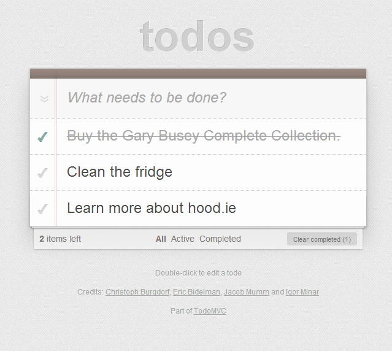
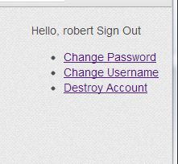
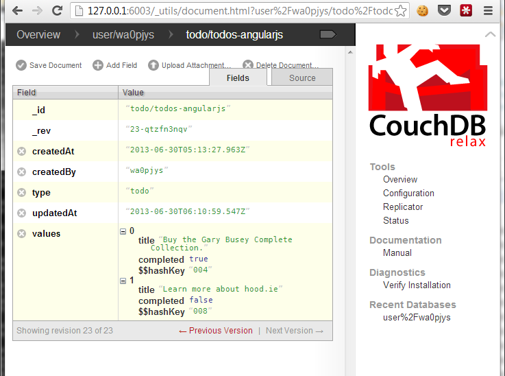

### Hood.ie + TodoMVC - For More Best Power!

Now that I have Hood.ie [working on my Windows 7]({{ site.url }}/blog/getting-hoodie-0-2-working-on-windows-7-x64/) laptop, I wanted to get something going quickly to really see what was up. But I didn't want to go down a app-building yak-shaving path filled with time-sinks and bike sheds. So I did something else.

I went over to [todomvc.com](http://todomvc.com) and grabbed their AngularJS site. Why AngularJS? I don't know AngularJS. I use KnockoutJS at work but the AngularJS site was perfectly structured for this. The persistence code was all in a single object ([todoStorage.js](https://github.com/tastejs/todomvc/blob/gh-pages/architecture-examples/angularjs/js/services/todoStorage.js)) which I assumed would make the process much easier.

_I now want to spend more time learning about Angular._

Next I created an empty hoodie app called "todo" (go read [hood.ie](http://hood.ie) if you don't know how to do this).

I then did a little pseudo merge of the TodoMVC app and the hoodie app. I wanted the TodoMVC look and feel but I needed to copy over the css and js of the hoodie app. In addition I put the css and js links in the TodoMVC index.html file. Also check out the [history of gambling](https://www.ilikepens.co.uk/5-biggest-wins-gambling-history/) and why is it linked to the history of humanity.

You can see the updated code on GitHub at [https://github.com/bubbafat/hoodieangulartodo](https://github.com/bubbafat/hoodieangulartodo). Diff it against the Angular code (linked above) if you are really curious. Oh, I also brought the authentication UI code into index.html as well. Why? Because if you aren't logged in then you don't get to use couchdb (per the hoodie docs, it will use local storage - not very interesting for this case).

Then it was just a few changes.

#### Updating how items are saved

```js
todomvc.factory('todoStorage', function () {
    var STORAGE\_ID = 'todos-angularjs';

    return {
        get: function () {
            var deferred = $.Deferred();

            hoodie.store.findOrAdd('todo', STORAGE\_ID, {values: \[\] })
                .then(function(loaded) {
                    deferred.resolve(loaded.values);
                })
				
            return deferred.promise();
        },

        put: function (todos) {
            hoodie.store.update('todo', STORAGE\_ID, {values: todos })
        }
    };
});
```

These are the important points:

1. I use a fixed ID - think of that as the list "name". This means I'm not saving N instances of a todo but rather a single list with an array of todos.
2. When saving the array I store it in a property named "values" - this is because I don't want to muck with the actual values (adding IDs, etc) but rather just wanted to store them.
3. I load using findOrAdd. This allows me to either load the saved array or provide a default (empty array) in a single pass.
4. I save using update. Since I know that findOrAdd ensured that the document exists in couch (let's be optimistic that nothing deleted it), I know I can just update it
5. I return a promise from the getter. The save is async so this is necessary. We'll see the consumer change next.

#### You said something about a consumer change?

Since the getter returns a promise, not the actual array, I needed to respect that promise on the calling side.

```js
todomvc.controller('TodoCtrl', function TodoCtrl($scope, $location, todoStorage, filterFilter) {
    var todos

    var promise = todoStorage.get();
    promise.done(function(loaded) {
        todos = $scope.todos = loaded;
    });
```

/\* ... nothing else changed ... \*/

The only change here is using the done method to get the results. Yeah, I'm being optimistic about it and not checking for failure.

#### So how does it look?



But what about the login stuff? Well ... I didn't make that pretty.



I just don't care.

#### But how do I know it worked?

Let's look at the CouchDB data ...



There you go. You can see the user was created (we're in their database) and the document contains the todo items. Actually, it is missing one but that's just because of how I took the screen shots. Deal with it.

#### But fast, right?

Hood.ie claims they enable people to do awesome things really fast. I'm paraphrasing (but just a little).

I'm not a JavaScript developer. I'm improving, but I'm more of a .NET backend guy. It's something I've been meaning to work on. That's what led me to this. I mention this to set the bar appropriately for what follows.

_8 hours ago I had never heard of Hood.ie._

It took about **90 minutes** to work through the Windows installation kinks (see my previous blog post about it) and then I spent about **90 minutes** reading the documentation and digging into the source code.

I spent about **an hour** choosing the TodoMVC app to base it on and then digging through the code to understand what to do.

**15 minutes** merging the projects. That includes integrating the Hood.ie security. Think about that. It took less than 15 minutes for a person with no experience in any part of the stack to take an existing single user app and make it a multi-user application with robust security and data storage.

Finally it took me about **30 minutes** to realize the right way to persist the todo instances and learn about how promises are used in Javascript (I am familiar with async programming in other languages so the concept was easy, but I had not used defer specifically. Good stuff.

So really only about an hour doing something specifically related to the task of "use hood.ie for security and storage in this app"

_Had I known what the hell I was doing it would have been about 10 minutes._

Seriously.

Bravo, hood.ie, brav-fucking-o.
