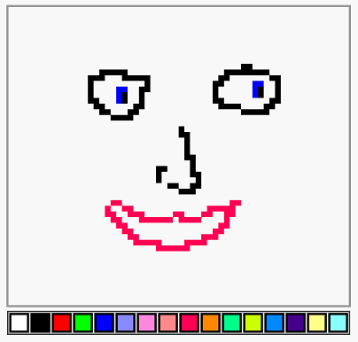
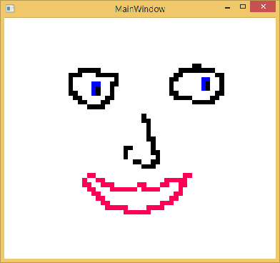

* * *

_Update: How events work has changed and the drawing app is now available as a sample on GitHub. Find out more here: [http://www.roberthorvick.com/2014/03/28/firebase-events-in-the-net-client/](http://www.roberthorvick.com/2014/03/28/firebase-events-in-the-net-client/)_

* * *

[Firebase](http://firebase.com) is one of the new-fangled application platforms. In other words, it is a REST interface over CRUD storage of JSON objects.

What is lacking, however, is a Firebase .NET API - and it ain't getting one soon.

<blockquote class="twitter-tweet" lang="en">
<a href="https://twitter.com/bubbafat">@bubbafat</a> We’re planning on adding a C# library by the end of the year! / cc <a href="https://twitter.com/Firebase">@Firebase</a>
— Sara Robinson (@SRobTweets) <a href="https://twitter.com/SRobTweets/statuses/448503702446305280">March 25, 2014</a></blockquote>

## I'm impatient

I wanted to procrastinate try something new so I spent a few hours throwing one together. The basic idea was to provide very thin, async, wrappers in a portable .NET library.

The source code is on GitHub: [https://github.com/bubbafat/FirebaseSharp](https://github.com/bubbafat/FirebaseSharp)

It is also a Nuget package: [https://www.nuget.org/packages/FirebaseSharp/](https://www.nuget.org/packages/FirebaseSharp/)

## Firebase .NET Client

### Create the Firebase .NET object

Firebase fb = new Firebase(new Uri("https://dazzling-fire-1575.firebaseio.com/"));

### Create the Firebase object with an auth token

string rootUri = "https://dazzling-fire-1575.firebaseio.com/";
string authToken = "YOUR FIREBASE AUTH TOKEN";

Firebase fb = new Firebase(rootUri, authToken);

### Post Data

string path = "/path";
string data = "{{\\"value\\": \\"Hello!\\"}}";

string id = fb.Post(path, data);

### Get Data

string jsonData = gb.Get(path);

### Stream Data

Response resp = fb.GetStreaming(path, response => {
   // see https://www.firebase.com/docs/rest-api.html
   // response.Event
   // response.Payload
});

// resp.Dispose() !

### Delete Data

fb.Delete(path);

## The Big Demo

Firebase has a bunch of sample applications. One of them is a multi-user realtime [drawing application](https://www.firebase.com/tutorial/#example/drawing).

It looks like this:

And if multiple browsers all connect to the same URL - they can all draw on the canvas at the same time.

So using my Firebase .NET client I made a stripped-down WPF port.

Honestly, most of the app is just converting the Firebase JSON into WPF Points, Rectangles and Brushes.

The most interesting thing is probably that the WPF UI only updates when the message comes back from Firebase. What I mean is that the MouseDown handler is this:

private readonly BlockingCollection \_queue = new BlockingCollection();

/\* skip a bunch \*/

private void PaintCanvas\_OnMouseDown(object sender, MouseButtonEventArgs e)
{
    Point firebasePoint = FirebasePointFromCanvas(GetNormalizedPoint(e.GetPosition(PaintCanvas)));
    \_queue.Add(new PaintQueue
    {
        Point = firebasePoint,
        Color = "000",
    });
} 

_Yeah, I hard-coded the color black ... the point was learning about Firebase, not WPF._

Notice all I did was stick a message in a BlockingCollection? That's basically a queue.

That's because my background worker is doing this:

void \_firebaseWorker\_DoWork(object sender, DoWorkEventArgs e)
{
    // setup streaming
    \_firebase.GetStreaming(string.Empty, PaintFromFirebase);
 
    // changes are queued so that the UI thread doesn't need
    // to do anything expensive
    while (true)
    {
        PaintQueue queue = \_queue.Take();
 
        try
        {
            \_firebase.PutAsync(string.Format("{0}:{1}", queue.Point.X, queue.Point.Y), 
                               string.Format("\\"{0}\\"", queue.Color)).Wait();
        }
        catch (Exception)
        {
            // This is really robust
        }
    }
}

It is just draining from the queue and sending things to Firebase.

Then when the update event comes from Firebase the streaming callback (PaintFromFirebase) gets called which ends up calling:

PaintPoint(
    NormalizedPointFromFirebase(result.path.Substring(1)), 
    GetBrushFromFirebaseColor(result.data));

Just want to see it all? I made a gist here: [https://gist.github.com/bubbafat/9789791](https://gist.github.com/bubbafat/9789791)

The long and short of it is that my app looks like this:

All those pixels came from Firebase and they update in real time. See... just check this video:

<iframe src="//player.vimeo.com/video/90142319" width="500" height="281" frameborder="0" webkitallowfullscreen mozallowfullscreen="" allowfullscreen=""></iframe>

[Demo of Firebase and WPF playing together using the FirebaseSharp library](http://vimeo.com/90142319) from [Robert Horvick](http://vimeo.com/user25733081) on [Vimeo](https://vimeo.com).
